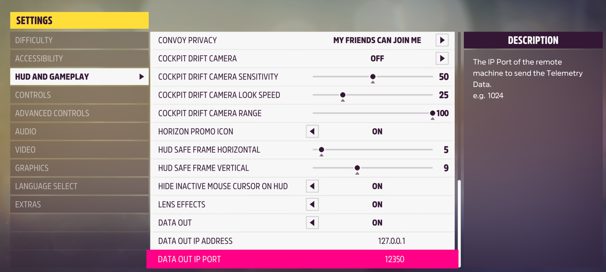
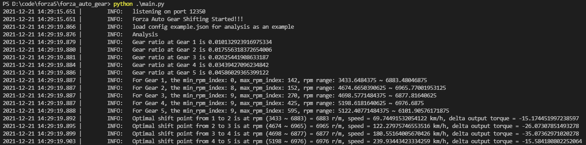
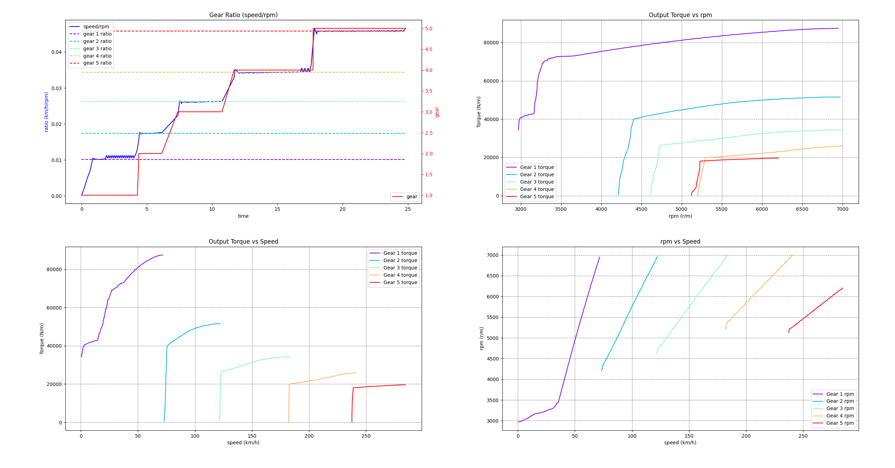
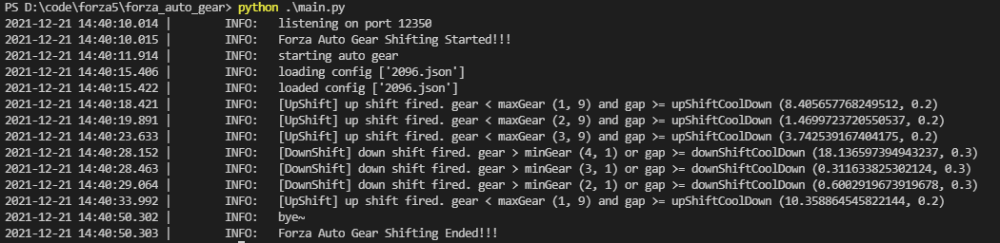

[简体中文](./README.zhcn.md)

# forza_auto_gear
forza_auto_gear is a tool for Forza Horizon 5. It will help us understand the best gear shift point using Manual or w/ Clutch in Forza Horizon 5. Built with python.

## Quick View
A800, GTR93, drag strip
- Automatic (00:27.665):

- Manual (00:27.166):

- Manual with Clutch (00:26.441):

- Program, Manual with Clutch (00:26.265):


## Prerequisites
Install >= Python 3.8

## Installation
```
pip3 install -r requirements.txt
git submodule init
git submodule update --recursive
```

## Usage
0. Setup the data out:

1. Run main.py
2. F10 starts the data collection:
    - Find a drag strip location.
    - Starting from Gear 1, accelerate until fuel cut-off (rpm is vibrating), then up shifting gear. Repeat until reaching the maximum gear.
    - Press REWIND to pause, then press F10 to stop data collect.
3. F8 to analyze the data. It will generate the car performance figures like below:


Then the result will be saved at `./config/{car ordinal}.json`
4. F7 to start auto gear shifting!

5. Press F7 again to stop.

## Moreover
1. By default the shifting mode is Manual with Clutch. You could change it in `constants.py`.
2. Lots of variables could be modified in `constants.py`
3. If you already have the config file, then run F7 directly. It will load the config automatically while driving. Or you could share configs to your friends. Don't forget to share your car tune as well :)
4. You could modify the log level in `logger.py` for console and file handlers.
5. Feel free to modify any logic to fit your style.

## Acknowledgments
- [forza_motorsport](https://github.com/nettrom/forza_motorsport) for data reading protocol
- [forza-MT-auto](https://github.com/Yuandiaodiaodiao/forza-MT-auto) for the inspirations
- [Optimal Shift Point](https://glennmessersmith.com/shiftpt.html) for shift point calculation
