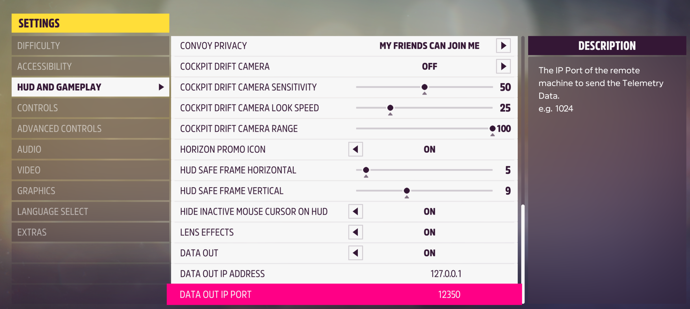
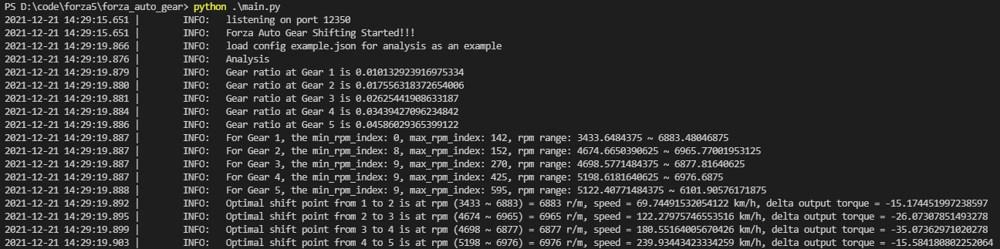

[English](./README.md)

# forza_auto_gear
forza_auto_gear 是为极限竞速：地平线5开发的一款测试工具。它能帮助玩家更好地理解手动档和手离的最佳换挡时机。 此软件使用python编写。

## 先上结果图
A800，GTR93，飞机场直线加速
- 自动挡 (00:27.665):

- 手动挡 (00:27.166):

- 手离结合 (00:26.441):

- 程序运行+手离结合 (00:26.265):


## 环境需求
Install >= Python 3.8

## 安装
```
pip3 install -r requirements.txt
git submodule init
git submodule update --recursive
```

## 使用方式
0. 如下图，打开数据输出，并设置地址和端口:

1. 运行 main.py
2. F10 启动当前车辆数据收集:
    - 找一个直线竞速的起点，或者告诉直线。这样方便长距离加速。
    - 从1档开始，逐渐加速（满油门但不要打滑）直到断油（转速开始疯狂抖动），然后手动升到下一档。依次往复直到最大档，或你只使用的最大档。
    - 按回转暂停数据输出，此时再按F10停止数据分析。
3. F8 分析收集好的数据，并且会生成车辆性能和发动机分析图:


Then the result will be saved at `./config/{car ordinal}.json`
4. F7 开始自动升降档!

5. 再按一次则可以停止.

## 杂谈
1. F7的默认是手离结合。如果不想使用手离，而只想用手动，则可以修改 `constants.py`的参数配置。
2. `constants.py`还有很多参数可以修改，可以自己尝试最适合自己的配置~
3. 如果你已有生成好的配置文件，则可以直接F7运行。程序会自动读取当前车辆配置。如果没有当前车辆配置则会退出自动升降档模式。具体日志可查看`./log`的文件。你也可以分享自己的配置文件给你朋友，让他们体验下你的配置~当然必须得告诉你朋友你的车型号和调教~
4. 日志等级可以在 `logger.py`修改。这可以改变console和日志文件的输出等级。
5. 你可以修改更多逻辑来实现最适合自己的开车模式！！

## 鸣谢
- [forza_motorsport](https://github.com/nettrom/forza_motorsport) 感谢提供数据接口
- [forza-MT-auto](https://github.com/Yuandiaodiaodiao/forza-MT-auto) 感谢提供设计思路和灵感
- [Optimal Shift Point](https://glennmessersmith.com/shiftpt.html) 感谢提供最佳换挡时机算法