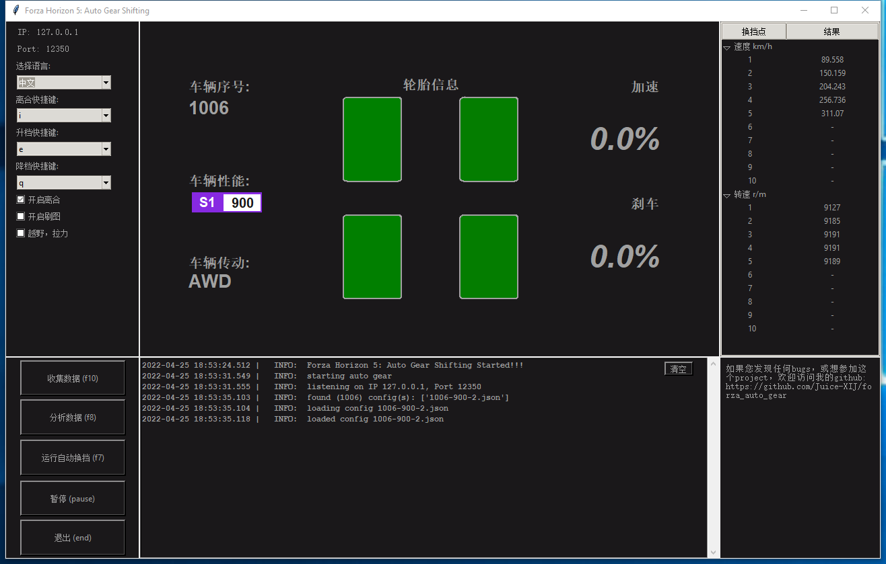
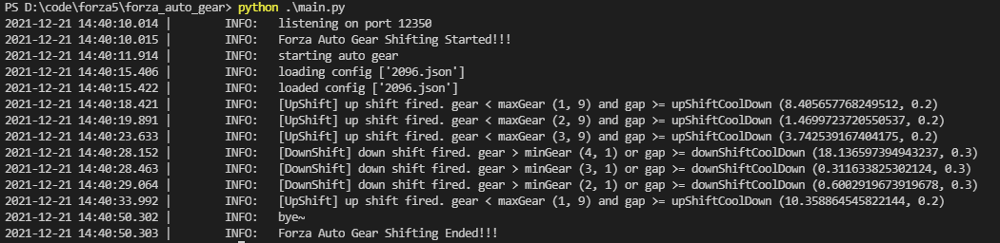

[English](./README.md)

# forza_auto_gear
forza_auto_gear是为极限竞速：地平线5开发的一款测试工具。功能如下：

0. 图形界面，让你更轻松使用这款工具。
1. 它能帮助玩家更好地理解手动档和手离的最佳换挡时机。 且可以进行自动升降档。
2. 挂机刷图。能自动定时刹车。如果车卡住了，会自动复位。此功能可以和升降档同时使用，提高效率。
3. 拉力越野特殊设置。这会自动升降档在很滑的地面也能够运行。
4. 支持双语~

## 环境需求
Install >= Python 3.8

## 游戏设置
如下图，打开数据输出，并设置地址和端口:


## 安装
1. 如果你想下载源代码运行：
    ```
    pip3 install -r requirements.txt
    git submodule init
    git submodule update --recursive
    ```
2. 你也可以直接在[release](https://github.com/Juice-XIJ/forza_auto_gear/releases)里下载打包好的程序`Forza_Auto_Gear_GUI`，并运行 `Forza_Auto_Gear_GUI.exe`.

## 使用方式
### 运行程序
如果下载的是打包好的程序，则直接运行`Forza_Auto_Gear_GUI.exe`。如果下载的是源代码，可以运行 `python ./gui.py`来使用图形界面. 如果更喜欢命令行模式，可以运行 `python ./main.py`

### 自动升降档使用说明
1. 先上结果图
    GUI Demo

    

    A800，GTR93，飞机场直线加速
    - 自动挡 (00:27.665):
    
    - 手动挡 (00:27.166):
    
    - 手离结合 (00:26.441):
    
    - 程序运行+手离结合 (00:26.265):
    
2. F10 启动当前车辆数据收集:
    - 找一个直线竞速的起点，或者高速直线。这样方便长距离加速。
    - 从1档开始，逐渐加速。1挡刚起步为了避免打滑，可以不用满油门，但当转速提起来以后可以满油门。一直到断油（转速开始疯狂抖动），然后手动升到下一档。依次往复直到最大档，或你只使用的最大档。
    - 按回转暂停数据输出，此时再按F10停止数据分析。
3. F8 分析收集好的数据，并且会生成车辆性能和发动机分析图:


然后结果会保存到 `./config/{car ordinal}.json`以备后续直接使用。
4. F7 开始自动升降档！再按一次则可以停止.
    - GUI:
    

    - Command Line:
    
### 挂机刷图使用说明
如何你想在蓝图刷经验或者技能点， 可以开启刷图模式，即图形界面左侧，勾选`farm`选项即可。他会帮你定时刹车来避免AFK检测，以及当你的车卡在某个地方的时候，自动重置车的位置。但仍然需要玩家自己卡住加速键。这个可以用XBOX BAR或者牙签来卡，具体方法可以看看B站~

## 杂谈
1. F7的默认是手离结合。如果不想使用手离，而只想用手动，则可以修改 `constants.py`的参数配置。如果使用图形界面，则可以在左上角直接进行修改。在图形界面的左侧面板，也可以快速修改部分快捷键~
2. `constants.py`还有很多参数可以修改，可以自己尝试最适合自己的配置~
3. 如果你已有生成好的配置文件，则可以直接F7运行。程序会自动读取当前车辆配置。如果没有当前车辆配置则会退出自动升降档模式。具体日志可查看`./log`的文件。你也可以分享自己的配置文件给你朋友，让他们体验下你的配置~当然必须得告诉你朋友你的车型号和调教~
4. 日志等级可以在 `logger.py`修改。这可以改变console和日志文件的输出等级。
5. 你可以修改更多逻辑来实现最适合自己的开车模式！！

## 鸣谢
- [forza_motorsport](https://github.com/nettrom/forza_motorsport) 感谢提供数据接口
- [forza-MT-auto](https://github.com/Yuandiaodiaodiao/forza-MT-auto) 感谢提供设计思路和灵感
- [Optimal Shift Point](https://glennmessersmith.com/shiftpt.html) 感谢提供最佳换挡时机算法